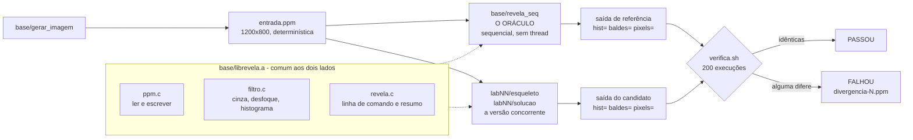
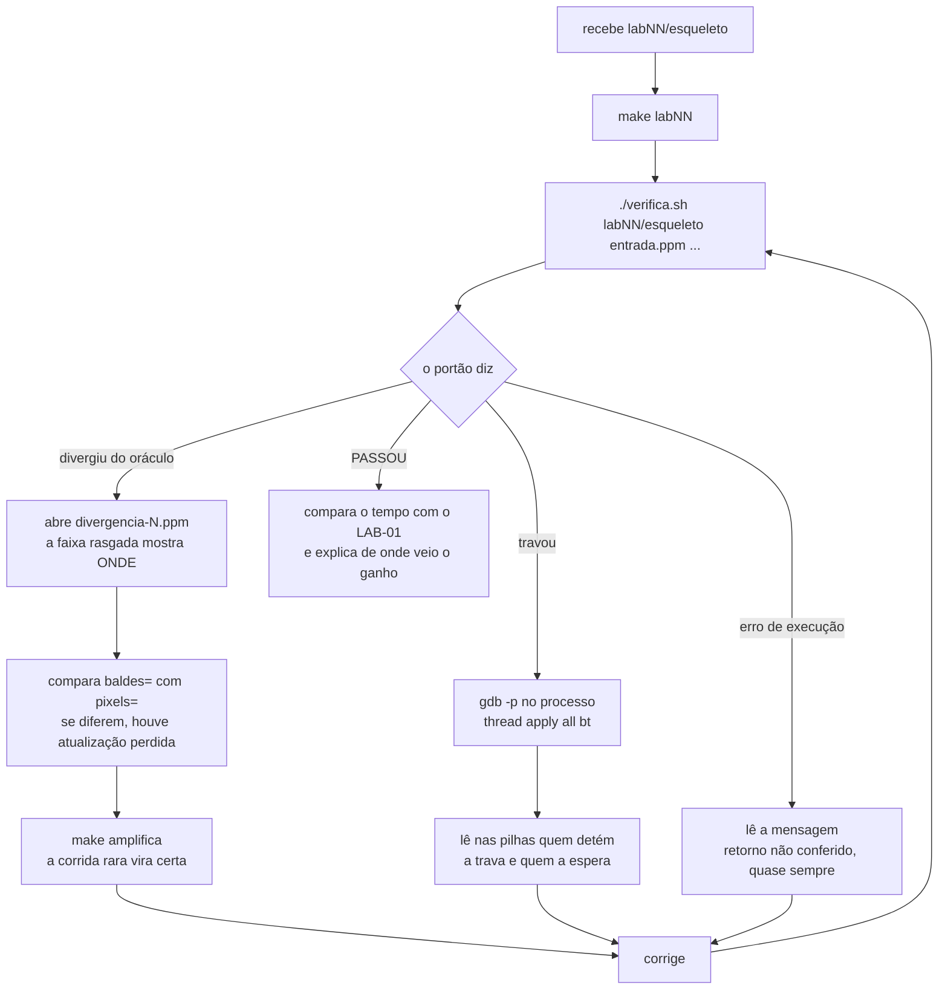

# LPII - Programação Concorrente em C/C++

**Universidade Federal da Paraíba - Centro de Informática**  
**Linguagem de Programação II**  
**Prof. Carlos Eduardo Coelho Freire Batista**

Código da disciplina. Espelho de `exemplos/` no material-fonte: o livro e
o site saem do mesmo lugar, e nenhum trecho é digitado duas vezes.

## Portões de qualidade

Todo fonte deste repositório compila com `-Werror`:

```
gcc -O2 -Wall -Wextra -Werror -pthread          # C
g++ -std=c++17 -O2 -Wall -Wextra -Werror -pthread   # C++
```

`-Werror` não é zelo. O gcc devolve zero com avisos na tela, de modo que
afirmar "compila sem avisos" a partir do código de saída é falso.

**C++17 é o teto**, e não C++20: é o que o laboratório tem (GCC 9-10).
`std::latch`, `std::barrier`, `counting_semaphore` e `jthread` não existem
aqui - são implementados à mão e citados como C++20 apenas para
reconhecimento de API.

```
make          # compila tudo
make roda     # compila e executa cada um
make limpa

# um exemplo só, pelo caminho do alvo:
make c/modulo1-fundamentos/11-race-condition/race_condition
```

## O que o laboratório tem

`gcc`, `g++`, pthreads, `semaphore.h` e `gdb`. **Não há ThreadSanitizer,
Helgrind nem `perf`.** Nenhum exercício depende deles.

O portão é `revela/verifica.sh`: compara a saída com a do oráculo
sequencial e repete a execução 200 vezes exigindo resultado idêntico.
Três técnicas substituem o detector, e todas são conteúdo da disciplina:
repetir e exigir igualdade; alargar a janela da seção crítica (`JANELA()`
em `revela/base/janela.h`, ligada por `make amplifica`); e ler um programa
travado com `gdb -p` seguido de `thread apply all bt`.

Os exemplos deliberadamente quebrados vêm marcados como tais e
acompanhados da saída do ThreadSanitizer que os acusa, em arquivos
`.tsan.txt` ao lado do fonte. O TSan roda na máquina de projeção, e não
no laboratório - a saída está aqui para ser LIDA, não reproduzida.

## Estrutura

```
c/modulo1-fundamentos/    <- Processos, fork, pipes, sinais, threads
  01-fork-basico/
  02-fork-multiplos/
  03-fork-exec/
  04-pipe-basico/
  05-pipe-bidirecional/
  06-pipeline-multi/
  07-named-pipe/
  08-estoque-fork-mmap/
  09-threads-basico/
  10-threads-retorno/
  11-race-condition/
  12-soma-paralela/
  13-sinais/
  14-thread-attr/
c/modulo2-sincronizacao/    <- Mutex, semáforos, barreiras, condvar, atômicos
  01-spinlock/
  02-ticket-lock/
  03-pthread-spinlock/
  04-mutex-basico/
  05-mutex-tipos/
  06-trylock/
  07-atomics/
  08-semaforo-pool/
  09-semaforo-nomeado/
  10-barreira-posix/
  11-condvar-prod-cons/
  12-condvar-timedwait/
  13-barreira-condvar/
  14-rwlock/
  15-jantar-filosofos/
  16-deadlock-demo/
  17-reordenacao/
  18-memory-orders/
  19-happens-before/
  20-aba-seqlock/
  21-ticket-justo/
c/modulo3-comunicacao/    <- Monitores, memória compartilhada, sockets
  01-monitor-estoque-c/
  04-shm-posix/
  06-servidor-tcp/
  07-cliente-tcp/
  08-servidor-tcp-mt/
  09-servidor-udp/
  10-cliente-udp/
  11-drone-telemetria/
  12-select-epoll/
  13-http-cru/
  14-pool-roubo/
cpp/    <- RAII e coordenação em C++17
  01-raii/
  02-latch-barrier/
medidas/    <- Medições que o material afirma
  contencao.c/
revela/    <- o artefato que atravessa a disciplina
  base/
  lab01/
  lab02/
  lab03/
  lab04/
  lab05/
  lab06/
  lab07/
  lab08/
  lab09/
  lab10/
  lab11/
  lab12/
```

## Revela

Um filtro sobre imagens PPM que começa sequencial e cresce a cada
conceito, até virar um servidor concorrente. Substitui o MiniChat das
edições anteriores, e a troca é mecânica e não estética: **a versão
sequencial é a especificação executável de todas as outras.** Uma versão
concorrente correta produz exatamente o mesmo arquivo, byte a byte, e o
`diff` decide a correção sem julgamento de ninguém - o que um chat
interativo e não-determinístico não permite.

São 12 laboratórios de 30 minutos, cada um com esqueleto e solução.

### Como as peças se encaixam

O oráculo e a sua versão leem a mesma entrada e usam a mesma
biblioteca de leitura, filtro e escrita. A única diferença entre os
dois é a estratégia de concorrência, e é daí que vem a força do
portão: qualquer diferença na saída é, necessariamente, defeito de
concorrência.



### O ciclo de trinta minutos

O portão responde em segundos e distingue três formas de falha.
Cada uma tem uma técnica associada, e nenhuma delas depende de
ferramenta que o laboratório não tenha.



## Números

- 76 fontes em C e 4 em C++
- 2 Makefiles
- 12 laboratórios do Revela

## Material completo

Livro e site interativo são gerados do mesmo material-fonte que este
código. Distribuídos via SIGAA.
