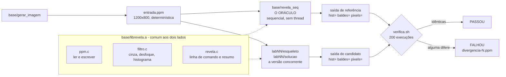
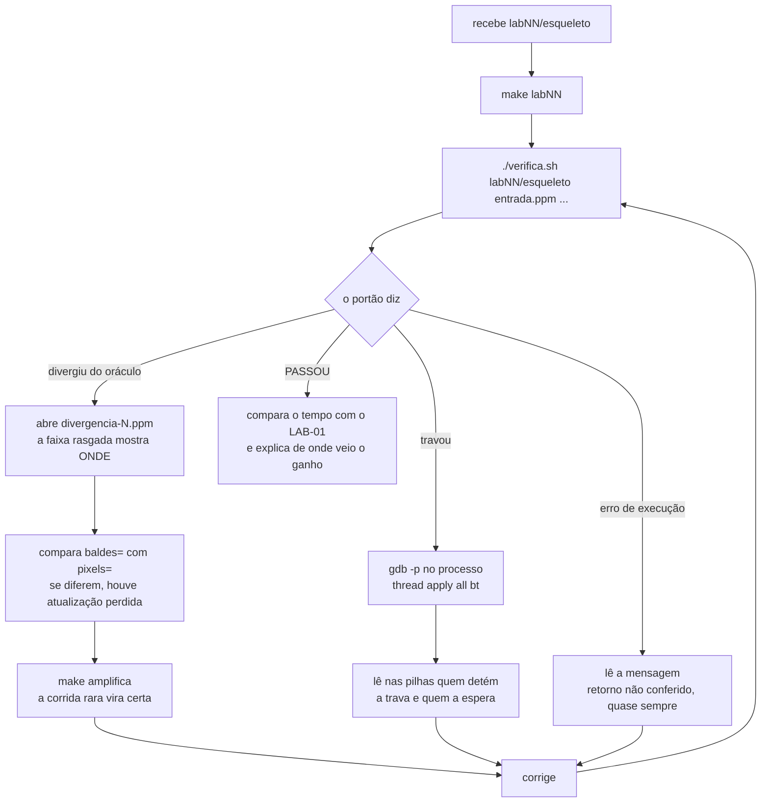

# Revela - o artefato que atravessa a disciplina

Um pipeline de tratamento de imagem em PPM que começa sequencial e cresce a cada
conceito, até virar um servidor concorrente. Todo laboratório de aula acrescenta uma
peça a ele.

## Por que imagem, e não um chat

Porque a correção precisa ser objetiva e imediata - 30 minutos de aula, nota na hora.

**A versão sequencial é a especificação executável de todas as outras.** Uma versão
concorrente correta produz exatamente o mesmo arquivo, byte a byte. Isso dá um
oráculo mecânico, que nenhum artefato interativo teria: um chat não tem saída
comparável.

E há o segundo motivo, que é pedagógico: **a falha é visível**. Uma race condition
entre faixas aparece como faixa rasgada na imagem, não como número errado num
relatório.

## O laboratório não tem sanitizer

As máquinas do laboratório têm `gcc`, `g++`, pthreads, `semaphore.h` e `gdb`. Não
têm ThreadSanitizer nem Helgrind. Isso deixou de ser limitação e virou conteúdo: sem
detector automático, o estudante precisa das técnicas que tornam o não-determinismo
reproduzível à mão.

| Técnica | Como aparece aqui |
|---|---|
| Repetir e exigir igualdade | `verifica.sh` roda 200 vezes e compara com o oráculo |
| Alargar a janela da seção crítica | `JANELA()` em `base/janela.h`, ligada por `make amplifica` |
| Ler o estado de um programa travado | `gdb -p` e `thread apply all bt` - o LAB-02 trava de propósito |
| Contar o que deveria bater | o resumo imprime `baldes=` e `pixels=`; se diferem, houve atualização perdida |

O ferramental completo continua no material e aparece na aula, na máquina de
projeção. O papel dele inverte: em vez de oráculo, vira **confirmação** - o
estudante primeiro reproduz e explica a falha com o que tem na mão, e só depois vê a
ferramenta apontar as duas linhas que ele já havia identificado.

## Arquitetura

Uma biblioteca comum, um oráculo e doze candidatos. A propriedade que sustenta
tudo está na figura: **o oráculo e o candidato leem a MESMA entrada e usam o
MESMO código de leitura, filtro e escrita.** A única coisa que difere entre eles
é a estratégia de concorrência - e é por isso que qualquer diferença na saída é,
necessariamente, defeito de concorrência.



Dois arquivos da `base/` não entram no caminho normal e existem para o ensino.
O `janela.h` define a macro `JANELA()`, que alarga a seção crítica e é ligada por
`make amplifica`: ela transforma uma corrida rara em corrida certa, sem alterar
uma linha da lógica. O `crono.h` mede tempo monotônico, que é o que permite
comparar um laboratório com o LAB-01 e afirmar ganho em vez de sensação.

## O que o estudante faz em trinta minutos



O ciclo é curto de propósito. O portão responde em segundos, diz qual das três
falhas ocorreu, e cada uma tem uma técnica associada - nenhuma delas dependendo
de ferramenta que o laboratório não tenha. Passar no portão não encerra o
laboratório: o resultado correto é o piso, e o que se discute depois é o tempo.

## Uso

```bash
make                 # compila base e laboratórios, zero warnings
make entrada         # gera entrada.ppm (1200x800), determinística
make verifica        # roda o portão nas soluções de referência
make amplifica       # recompila com a janela da seção crítica aberta
make lab03            # compila só um laboratório

./verifica.sh ./lab03/esqueleto entrada.ppm --threads 8
REPETICOES=500 ./verifica.sh ./lab05/solucao entrada.ppm --threads 8
```

O portão falha de três formas, e cada uma diz o que fazer:
divergência do oráculo (mostra o esperado e o obtido, e salva a imagem divergente),
travamento (imprime a linha de `gdb` para anexar ao processo) e erro de execução.

## Estrutura

```
base/        ppm.c ler e escrever PPM · filtro.c os filtros · revela.c linha de comando
             crono.h medição monotônica · janela.h alargamento da seção crítica
             revela_seq.c O ORÁCULO · gerar_imagem.c entrada determinística
lab01..lab12/  esqueleto (o que o estudante recebe) e solucao (referência)
verifica.sh  o portão, sem ferramenta especial
```

O esqueleto é o ponto de partida da aula e **falha o portão de propósito**. A
solução é a referência do docente. Os dois compilam sem um aviso sequer.

O laboratório é C ou C++17 conforme a extensão do fonte: o LAB-08 é `.cpp`,
porque é o do Capítulo 9, e todos os outros são `.c`. O Makefile tem uma regra
para cada extensão, o que evita um Makefile por laboratório.

## Estado

| | Laboratório | Estado |
|---|---|---|
| LAB-01 | O oráculo: filtro sequencial e tempo de base | pronto |
| LAB-02 | O mesmo filtro em dois processos, por pipe | pronto |
| LAB-03 | Faixas em threads, e a primeira race | pronto |
| LAB-04 | False sharing: medir, alinhar, medir de novo | pronto |
| LAB-05 | Três consertos para o mesmo contador, medidos | pronto |
| LAB-06 | Fila de blocos com backpressure | pronto |
| LAB-07 | Deadlock provocado e eliminado por ordenação | pronto |
| LAB-08 | latch à mão, em C++17 | pronto |
| LAB-09 | A fila vira monitor | pronto |
| LAB-10 | O pipeline atravessa a rede | pronto |
| LAB-11 | Onde o thread-por-cliente joelha | pronto |
| LAB-12 | O mesmo servidor em uma thread, com epoll | pronto |

Medido nesta máquina (24 núcleos), para calibrar expectativa:

- **LAB-03** perde 19.405 de 960.000 incrementos com 8 threads - `baldes=940595`.
  Reproduz na primeira execução, sem `make amplifica`; com ele, sempre.
- **LAB-04** dá **46x** de ganho com 8 threads e **1,01x** com uma. O controle de uma
  thread é o que prova que se mediu contenção, e não alinhamento.
- **LAB-05**: mutex 32,5 ms · atômico 1,9 ms · redução 0,9 ms. Trinta e quatro vezes
  entre a primeira resposta correta e a última.
- **LAB-06** troca de gargalo com o número de threads: com 1 consumidor o produtor
  espera 42 vezes, com 8 quem espera é o consumidor.
- **LAB-07** trava sempre no modo cruzado, e sempre termina no ordenado.
- **LAB-11 e LAB-12**: o thread-por-cliente satura em ~110 img/s e a latência cresce
  linearmente. **O epoll perde aqui** - 1300 ms contra 740 ms com 128 clientes - e
  entender por que é o laboratório: o reator barateia a conexão, não o trabalho.
